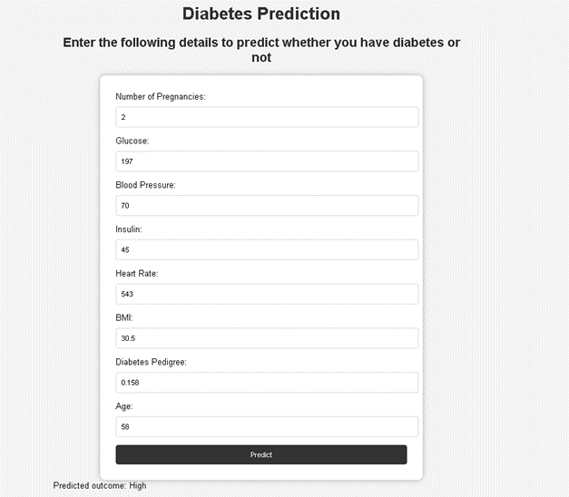

# Diabetes Prediction and Heart Rate Monitoring Project

## Overview
This project aims to predict diabetes based on diagnostic measurements and monitor heart rate using a Pulse Sensor and Arduino. It includes a machine learning model for diabetes prediction and a hardware setup for heart rate monitoring.

### Diabetes Prediction
The machine learning model utilizes various diagnostic measurements to predict the likelihood of a patient having diabetes. The dataset used for training and evaluation consists of Pima Indian females aged 21 and older. We employed logistic regression, random forest, support vector machine, and gradient boosting classifiers for this task.

#### Libraries Used
- Pandas
- NumPy
- Matplotlib
- Seaborn
- Scikit-learn
- Pickle
- Warnings
- Required Packages found in `installed_libraries.txt`
#### Data
The dataset contains the following columns:
1. Pregnancies
2. Glucose
3. BloodPressure
4. Insulin
5. HeartRate
6. BMI
7. DiabetesPedigreeFunction
8. Age
9. Outcome (Class variable: 0 or 1)

### Heart Rate Monitoring
The hardware setup involves connecting a Pulse Sensor to an Arduino to monitor heart rate. The Pulse Sensor utilizes optical heart-rate sensing by shining a green light on the finger and measuring the reflected light with a photosensor. The Arduino processes this data and can be visualized using Processing software.

#### Hardware Components
- Pulse Sensor
- Arduino

## Machine Learning Model Comparison
We compared the performance of different machine learning models on the diabetes prediction task. The models include Logistic Regression, Random Forest Classifier, Support Vector Machine, and Gradient Boosting.

### Results
1. Logistic Regression: 77% accuracy
2. Random Forest Classifier: 83% accuracy (best-performing model)
3. Support Vector Machine: 67% accuracy
4. Gradient Boosting: 70% accuracy

## Flask Web Application
The project includes a Flask web application for predicting diabetes levels and providing a chatbot interface for user interaction. The Flask app loads a pre-trained machine learning model for diabetes prediction (modelbest.pkl) and offers endpoints for predictions and chatbot interaction.

### Endpoints
- `/`: Renders the HTML template for the user interface.
- `/predict`: Accepts input data in JSON format, processes predictions, and returns results as JSON.

### Chatbot Integration
The chatbot enhances user experience by allowing inquiries, assistance, and guidance throughout the prediction process.

## Heart Rate Visualization
The Pulse Sensor data can be visualized using Processing software. The software reads the Serial Port and displays real-time heart rate data, BPM, and Interbeat Interval.

## Usage
1. Clone the repository.
2. Install required libraries using `pip install -r requirements.txt`.
3. Run the Flask web application using `python app.py`.
4. Connect the Pulse Sensor to the Arduino as described in the project documentation.
5. Upload the PulseSensor_BPM sketch to the Arduino using the Arduino IDE.
6. Run the Processing visualizer to monitor heart rate data.

## Project Structure
- `data/`: Contains the dataset for diabetes prediction.
- `notebook/`: Stores the pre-trained machine learning model and notebook .
- `static/` and `templates/`: Contain files for the web application.
- `Arduino/`: Includes the PulseSensor_BPM sketch for Arduino.
- `script`: Contains  `static/` and `templates/` for running Flask web app .
  ## Contributors

- George Youhana - g.ghaly0451@student.aast.edu
- Mostafa Magdy - Mustafa.10770@stemredsea.moe.edu.eg
- Abdallah Alkhouly- a.alkholy53@student.aast.edu
## Sample Web Page 

